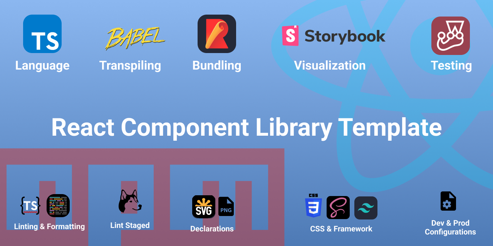

# React-Typescript-Template

<div align="center">

</div>

## Welcome to my React Component Library template

This template is built with the following technologies:

- Language: **TypeScript**
- Transpiling: **Babel**
- Bundling: **Rollup**
- Visualizatiion: **Storybook**
- Testing: **Jest**
- CSS Framework: **Tailwind**
- Styling: **CSS** & **SCSS**
- Linting: **ESLint**
- Formatting: **Prettier**
- Lint Staged: **Husky**
- **React Refresh**
- **Development** & **Production** configurations
  
## Getting Started

Using this template is very simple, follow the following instructions:

1. Fork the repository
2. Create a new repository and select forked repository as template

Or,

1. Clone the repository

```bash
git clone https://github.com/divshekhar/react-component-library-template.git
```

2. Install the dependencies

```bash
npm install
```

3. Start the development server

```bash
npm start
```

4. Build for production

```bash
npm run build
```

## Features

- [x] **TypeScript** for improved code quality and developer experience
- [x] **Jest** for unit testing
- [x] **ESLint** for linting and maintaining code consistency
- [x] **Prettier** for automatic code formatting
- [x] **Rollup** for bundling and building the application
- [x] **Babel** for transpiling modern JavaScript to older versions for better browser compatibility
- [x] **Storybook** for visualization of the developing components
- [x] **Tailwind** for easy development of components
- [x] **CSS** & **SCSS** for styling components
- [x] **Husky** for running lint-staged, which lints and fixes files before committing
- [x] **React Refresh** for faster development experience
- [x] Development & Production configurations for different environment settings

## Contributing

Please feel free to contribute to this project by submitting issues or pull requests.

## License

This project is licensed under the ISC License.

## Acknowledgements

Thank you for using this template. I hope it helps you build your next project with ease.
